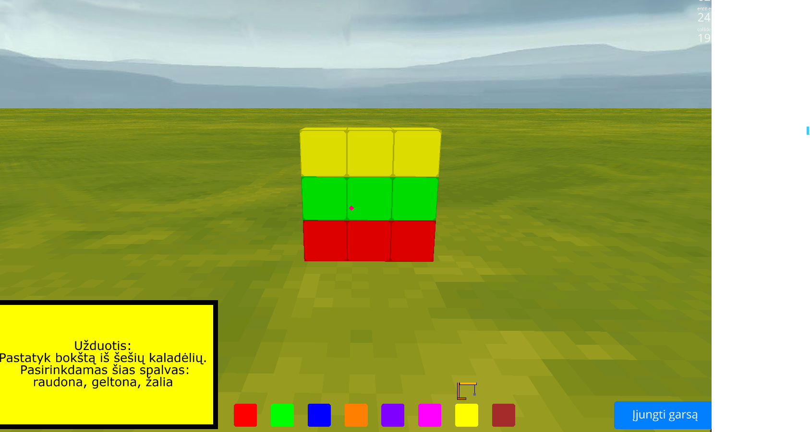

# Mano statybos

"Mano statybos" – tai pirmojo asmens žaidimas, sukurtas su [Ursina](https://www.ursinaengine.org/) žaidimų varikliu. Šis projektas skirtas CodeAcademy Python kurso baigiamajam darbui.

Šis žaidimas lavina erdvinius - vizualinius, girdimuosius suvokimus bei teksto skaitymo ir suvokimo įgūdžius.


---

## 🎮 Funkcionalumas
- Pirmojo asmens valdymas (judėjimas, šuolis, pelės žvilgsnis).
- Kaladėlių statymas ir šalinimas (kairysis ir dešinysis pelės mygtukai).
- Spalvos pasirinkimas su klaviatūros rodyklėmis arba mygtukais ekrane.
- Krano ikona juda pasirinkus spalvą (su garso efektu).
- Užduotis pateikiama **tekstu ir balsu** (naudojant `pygame` ir `.mp3`).
- Garsų įjungimo/išjungimo mygtukas ekrane.
- Fonas: žydras dangus, žemė padengta žole.

---

## 🛠️ Kaip paleisti

1. **Klonuok repozitoriją:**
```bash
git clone https://github.com/PauliusZajankauskas/Mano_statybos.git
```

2. **Įjunk virtualią aplinką (rekomenduojama):**
```bash
python -m venv venv
venv\Scripts\activate  # Windows
```

3. **Įdiek priklausomybes:**
```bash
pip install -r requirements.txt
```

4. **Paleisk žaidimą:**
```bash
python pirmasis_ursina.py
```

---

## 📂 Projekto struktūra
```
Mano_statybos/
├── assets/
│   ├── fonts/verdana.ttf
│   ├── sounds/click.wav, drill_sound.wav, uzduotis.mp3
│   └── textures/crane.png
├── pirmasis_ursina.py
├── sukurti_mp3.py
├── README.md
└── requirements.txt
```

---

## 🧠 Naudotos bibliotekos
- `ursina`
- `pygame`
- `time`

---

## 💡 Kodėl šis projektas?
Šį projektą pasirinkau, nes norėjau sukurti kūrybišką, vaikams pritaikytą žaidimą, kuris būtų ne tik interaktyvus, bet ir įtraukiantis. Projekte panaudojau realų balsą, kaladėlių logiką, paprastą valdymą bei vaikams suprantamą sąsają.

---

## 📜 Licencija
Šis projektas sukurtas mokymosi tikslais (CodeAcademy) ir yra viešai prieinamas GitHub'e.
