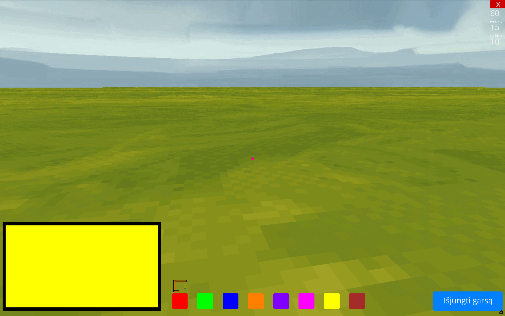

# Mano statybos

"Mano statybos" – tai pirmojo asmens žaidimas, sukurtas su [Ursina](https://www.ursinaengine.org/) žaidimų varikliu. Šis projektas skirtas CodeAcademy Python kurso baigiamajam darbui.

Šis žaidimas lavina erdvinius - vizualinius, girdimuosius suvokimus, dėmesio koncentraciją bei teksto skaitymo ir suvokimo įgūdžius. Skirtas priešmokyklinio ir pradinio ugdymo mokiniams, turintiems specialiųjų ugdymosi poreikių.



---

🎮 Funkcionalumas

Pirmojo asmens valdymas (judėjimas, šuolis, pelės žvilgsnis).

Kaladėlių statymas ir šalinimas (kairysis ir dešinysis pelės mygtukai).

Spalvos pasirinkimas su klaviatūros rodyklėmis arba mygtukais ekrane.

Krano ikona juda pasirinkus spalvą (su garso efektu).

Užduotis pateikiama tekstu ir balsu (naudojant pygame ir .mp3).

Garsų įjungimo/išjungimo mygtukas ekrane.

Fonas: žydras dangus, žemė padengta žole.

Šis žaidimas leidžia statyti bokštus iš kaladėlių, pasirinkus norimą spalvą. Čia pateikiamas žaidimo valdymo paaiškinimas:


🎮 Žaidimo valdymas – „Mano statybos“
🔹 Judėjimas ir kamera

W, A, S, D – vaikščiojimas pirmojo asmens režimu.

Pelė – žiūrėjimo kryptis.

Space – šuolis į viršų.

🔹 Kaladėlių valdymas
🖱️ Kairysis pelės mygtukas – padėti pasirinktą kaladėlę.

🖱️ Dešinysis pelės mygtukas – nuimti kaladėlę.

🔹 Spalvos pasirinkimas
⬅️ Kairė rodyklė – pasirinkti ankstesnę spalvą.

➡️ Dešinė rodyklė – pasirinkti kitą spalvą.

✳️ Pasirinkus spalvą, kranas juda į tos spalvos poziciją su animacija ir garsu.

🔹 Garsai
🔊 Kylanti rodyklė (↑) – įjungti garsą.

🔇 Nusileidžianti rodyklė (↓) – išjungti garsą.

🔹 Užduotis
U – parodyti užduoties langą su informacija:

Reikia pastatyti bokštą iš 6 kaladėlių.
Naudok raudoną, geltoną ir žalią spalvas.

T – tikrinti užduotį:

Jei teisingai – rodomas pozityvus pranešimas („Šaunu!“, „Jėga!“).

Jei klaida – rodomas pranešimas, ką pataisyti:

Trūksta spalvų.

Per daug arba per mažai kaladėlių.


---

## 🛠️ Kaip paleisti

1. **Klonuok repozitoriją:**
```bash
git clone https://github.com/PauliusZajankauskas/Mano_statybos.git
```

2. **Įjunk virtualią aplinką (rekomenduojama):**
```bash
python -m venv venv
venv\Scripts\activate  # Windows
```

3. **Įdiek priklausomybes:**
```bash
pip install -r requirements.txt
```

4. **Paleisk žaidimą:**
```bash
python pirmasis_ursina.py
```

---

## 📂 Projekto struktūra
```
Mano_statybos/
├── assets/
│   ├── fonts/verdana.ttf
│   ├── sounds/click.wav, drill_sound.wav, uzduotis.mp3
│   └── textures/crane.png
├── pirmasis_ursina.py
├── sukurti_mp3.py
├── README.md
└── requirements.txt
```

---

## 🧠 Naudotos bibliotekos
- `ursina`
- `pygame`
- `time`

---

## 💡 Kodėl šis projektas?
Šį projektą pasirinkau, nes norėjau sukurti kūrybišką, vaikams pritaikytą žaidimą, kuris būtų ne tik interaktyvus, bet ir įtraukiantis. Projekte panaudojau realų balsą, kaladėlių logiką, paprastą valdymą bei vaikams suprantamą sąsają.

---

## 📜 Licencija
Šis projektas sukurtas mokymosi tikslais (CodeAcademy) ir yra viešai prieinamas GitHub'e.
